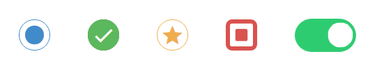

# Pretty checkbox

a tiny **css library** to make your checkboxes and radio buttons more creative.



Check it out the [Demo](https://lokesh-coder.github.io/pretty-checkbox/) for complete documentation.

### Get started

Install the library from `npm` or `yarn` package manager

```sh
> npm install pretty-checkbox
```
```sh
> yarn add pretty-checkbox
```
Add `pretty.min.css` in your html

From CDN,
```html
<link rel="stylesheet" href="https://cdnjs.cloudflare.com/ajax/libs/pretty-checkbox/3.0.0/pretty.min.css"/>
```
or from the source,
```html
<link rel="stylesheet" href="../PATH/pretty-checkbox/src/pretty.min.css"/>
```

You can also import `pretty.scss` in your main scss file.
```scss
@import '../PATH/pretty-checkbox/src/pretty.scss';
```
`PATH` is where the library is downloaded.

Checkbox markup,
```html
<div class="pretty">
  <input type="checkbox"/>
  <label><i class="mdi mdi-check"></i> Buy vegetables</label>
</div>
```

### Basic examples

##### Checkbox

```html
<div class="pretty primary">
  <input type="checkbox"/>
  <label><i class="mdi mdi-check"></i> Primary</label>
</div>
```

##### Radio

```html
<div class="pretty">
  <input type="radio" name="radio">
  <label><i class="mdi mdi-check"></i> Option 1</label>
</div>
<div class="pretty">
  <input type="radio" name="radio">
  <label><i class="mdi mdi-check"></i> Option 2</label>
</div>
```
Refer the [Documentation](https://lokesh-coder.github.io/pretty-checkbox/) for other features and sass settings.


### Custom font library

This library supports wide variety of font icon libraries. Currently tested with `FontAwesome` , `Bootstrap Glyphicon` , `Google Material Design icons(material.io)`, `Material Design icons (mdi)` , `Material Design icons (zmdi)` , `Typicons` , `Ionicons`.

### What else

- Scalable. Can be used in any font sizes
- Cool animations and toggle features
- Customizable. See the demo for `sass` settings
- Used in frameworks like bootstrap, Foundation, Sematic UI
- Supported in all mordern browsers, including mobile devices
- Print friendly
- MIT Licence

Thats all, folks!

### Inspiration

- Inspired from Okendoken's [awesome-bootstrap-checkbox](https://github.com/flatlogic/awesome-bootstrap-checkbox). 
- Crazy animations are heavily inspired ( copied 😊 ) from [Animista](http://animista.net)

Contributions are welcome! 


Basic Checkbox
    Square
    Curve
    Round
    Switch
Colors
    Solid
    Outline
    Switch
    Mixed
Font icons
    General
Svg
    General
Image
    General
Plain
Toggle
States
    Hover
    Focus
    Indeterminate
Disabled
Lock

Radio Buttons
    General
    Colors
Tested Font Icons
    Font Awesome
    MDI
    GMDI
    ZMDI
    Ionic
    Ion
    tyicons
    gylph
Tested Svg
    UIKit
    Feathers
Scalability
SCSS Customize
    import
    settings
More
    Browser support
    Frameworks
    Inspiration
    Support
    Contribution
    Licence